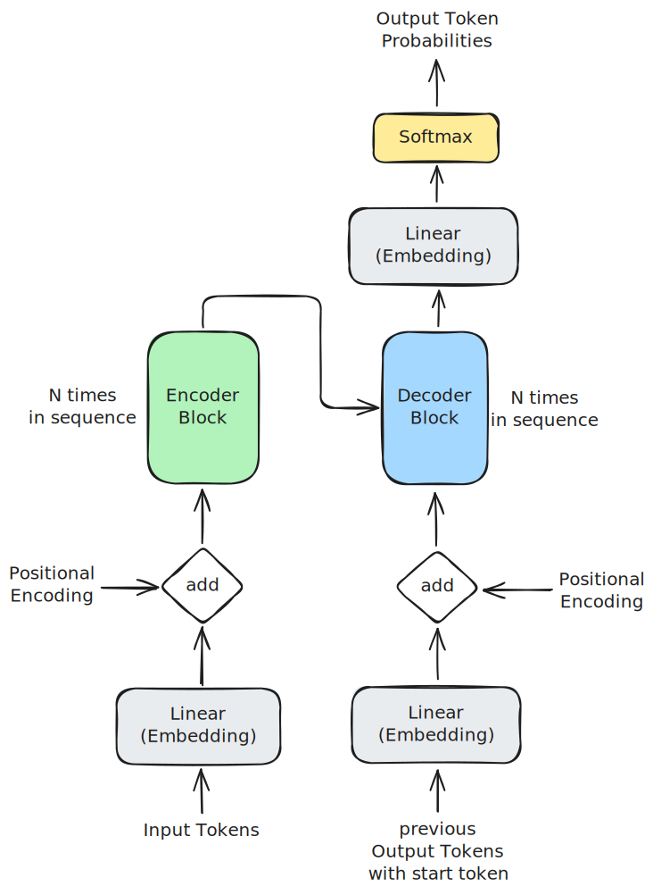
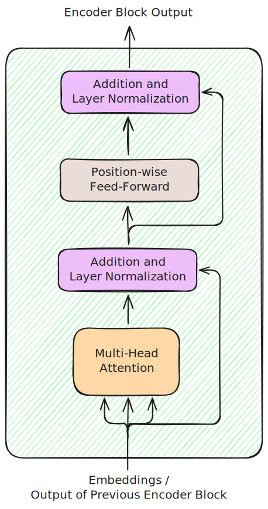
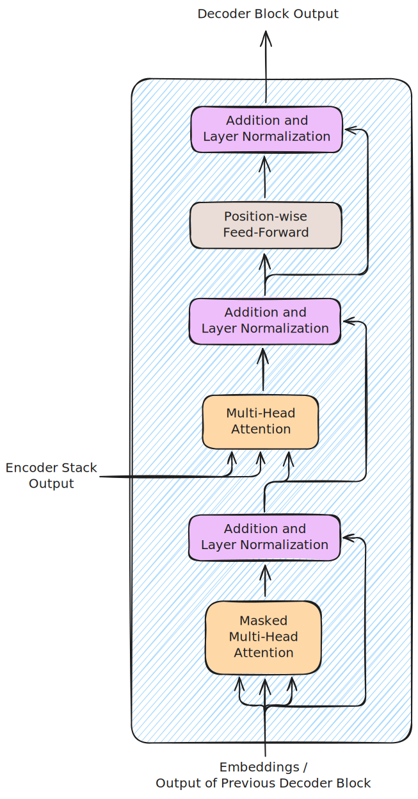
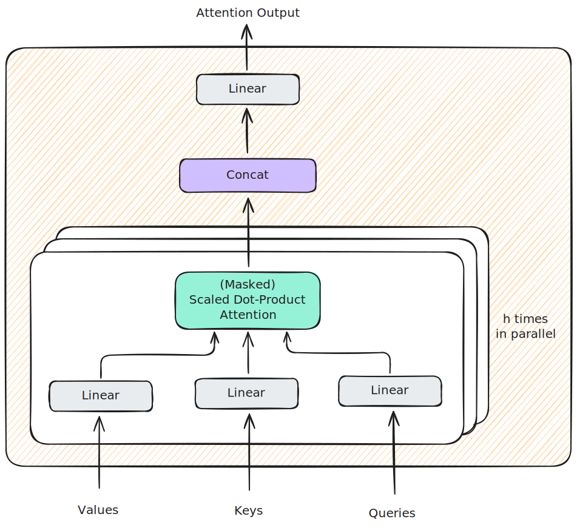

# Simple Transformer Implementation

This repository contains a simple implementation of the transformer architecture introduced in [Attention Is All You Need](https://proceedings.neurips.cc/paper/2017/file/3f5ee243547dee91fbd053c1c4a845aa-Paper.pdf).

## Prerequisites

Install the [uv package manager](https://docs.astral.sh/uv/getting-started/installation/).

Install the dependencies with:
```shell
uv sync
```

## Run the example training script on random data

```shell
uv run -m src.main
```

# Transformer architecture in detail
## Overview


The Transformer gets two different inputs: the input tokens and the output tokens it has already generated.
The tokens are integers representing the token IDs.
The generated output tokens that it gets as input are prepended by a special start token, that is necessary for two reasons: first, without the start token this input would be empty when generating the first output token, which is not possible.
Second, the Transformer generates as output the "next token" probabilities for each token it gets in the second input, so it's necessary to pad the previous output tokens with one additional token to keep the amount tokens in the second input and the output token probabilities the same.

The tokens from both inputs go through an embedding layer.
They share the same weights and are trained together with the rest of the Transformer.
As the tokens are IDs these layers are just table lookups.

To the output of the embedding layers a positional encoding will be added.
This helps the Transformer to understand the positions of the tokens, as it would otherwise have no way of knowing them.

There are N encoder blocks that form the encoder stack.
The first one gets the input embeddings with the added positional encodings as input and the others get the output of the previous encoder block as input.

There are also N decoder blocks that form the decoder stack.
The first one gets the previous token embeddings with the start token prepended.
The other blocks get the output of the previous block as input.
Every decoder block also gets the output of the encoder stack as second input.

The output of the decoder stack goes through a linear layer with the same weights (but transposed) as the two embedding layers at the beginning.
At the end is a softmax layer to output probabilities for the next token.
It's important to note that the output predicts the next token for each token the decoder stack got as input, but during inference only the predictions for the last one is relevant, as the other ones were already generated.

**Left embedding layer**

- Input: dtype=int64, shape=[batch size, input sequence length]
- Output: dtype=bfloat16, shape=[batch size, input sequence length, model size]
- Weights: shared with other embedding layer and the output linear layer
  - dtype=bfloat16, shape=[dictionary size, model size], uniform random initialization with 0 mean and $\frac{1}{\text{model size}}$ variance
  - this variance ensures that the output of the output linear layer has mean 0 and variance 1 when the input to that layer also has mean 0 and variance 1
  - for the embedding layers to have an output with mean 0 and variance 1, the returned embedding is multiplied with $\sqrt{\text{model size}}$

**Right embedding layer**

- Input: dtype=int64, shape=[batch size, output sequence length]
- Output: dtype=bfloat16, shape=[batch size, output sequence length, model size]
- Weights: shared with other embedding layer and the output linear layer

**Positional Encoding**

- shape=[sequence length, model size]
- $PE[pos, 2i]=sin(pos / 10000^{2i/\text{model size}})$
- $PE[pos, 2i + 1]=cos(pos / 10000^{2i/\text{model size}})$

**Output Linear**

- Input: dtype=bfloat16, shape=[batch size, output sequence length, model size]
- Output: dtype=bfloat16, shape=[batch size, output sequence length , dictionary size]
- Weights: shared with the embedding layers


## Encoder Block


- Input: dtype=bfloat16, shape=[batch size, input sequence length, model size]
- Output: dtype=bfloat16, shape=[batch size, input sequence length, model size]

**Multi-Head Attention**

For values, keys and queries it gets the same values as input, that's called self-attention.

- Input
  - Values: encoder block input, dtype=bfloat16, shape=[batch size, input sequence length, model size]
  - Keys: encoder block input, dtype=bfloat16, shape=[batch size, input sequence length, model size]
  - Queries: encoder block input, dtype=bfloat16, shape=[batch size, input sequence length, model size]
- Output: dtype=bfloat16, shape=[batch size, input sequence length, model size]

**Addition and Layer Normalization**

These layer get the output of the previous layer and the input of the previous layer as input.
They get added together and then layer normalization is applied across the last dimension of the tensor.

**Position-wise Feed-Forward**

This layer is defined by this formula: $FNN(x)=max(0, xW_1+b_1)W_2+b2$.
It is applied with the same weights and biases for each position in the sequence.

- Input: dtype=bfloat16, shape=[batch size, input sequence length, model size]
- Output: dtype=bfloat16, shape=[batch size, input sequence length, model size]
- Weights and biases
  - $W_1$: dtype=bfloat16, shape=[model size, inner size]
  - $b_1$: dtype=bfloat16, shape=[inner size]
  - $W_2$: dtype=bfloat16, shape=[inner size, model size]
  - $b_2$: dtype=bfloat16, shape=[model size]

## Decoder Block


- Input
  - Encoder stack output: dtype=bfloat16, shape=[batch size, input sequence length, model size]
  - Embeddings / output of previous decoder block: dtype=bfloat16, shape=[batch size, output sequence length, model size]
- Output: dtype=bfloat16, shape=[batch size, output sequence length, model size]

**Masked Multi-Head Attention**

Multi-Head Attention layer with mask as described below.
A lower triangular matrix is used as mask.
The diagonal elements and the elements below the diagonal are true, every other value is false.
The same mask is used for every example in the batch.
For values, keys and queries it gets the same tensor as input, that's called self-attention.

- Input
  - Values: encoder block input, dtype=bfloat16, shape=[batch size, output sequence length, model size]
  - Keys: encoder block input, dtype=bfloat16, shape=[batch size, output sequence length, model size]
  - Queries: encoder block input, dtype=bfloat16, shape=[batch size, output sequence length, model size]
  - Mask: dtype=bool, shape=[batch size, output sequence length, output sequence length]
- Output: dtype=bfloat16, shape=[batch size, output sequence length, model size]

**Multi-Head Attention**

Keys and values come from the output of the Encoder Stack and the queries from the previous "Addition and Layer Normalization"-Layer.

- Input
  - Values: encoder stack output, dtype=bfloat16, shape=[batch size, input sequence length, model size]
  - Keys: encoder stack output, dtype=bfloat16, shape=[batch size, input sequence length, model size]
  - Queries: output from previous layer, dtype=bfloat16, shape=[batch size, output sequence length, model size]
- Output: dtype=bfloat16, shape=[batch size, output sequence length, model size]

**Addition and Layer Normalization**
Same as in the encoder blocks.

**Position-wise Feed-Forward**
Same as in the encoder blocks.

## Multi-Head Attention architecture


The inputs each go through a linear layer to project them to new sizes.
This happens h-times in parallel with independent linear layers.
The keys and queries need to be projected to the same size, but the values could be projected to a different size, but are also projected to the same size.
The outputs of the linear layers are put though the scaled dot-product attention with optionally a mask.
The outputs of these operations are concatenated and projected with a linear layer to the model size.

**(Masked) Scaled Dot-Product Attention**

This layer can be used with a mask and without.
The first layer of each decoder block uses it with a mask, every other instance uses it without.
The mask defines which elements of the matrix will be set to negative infinity to deactivate attention between the corresponding sequence positions.

Without mask:
$$\text{Attention}(Q, K, V) = \text{softmax}(\frac{QK^T}{\sqrt{d_k}})V$$

With mask:
$$\text{Attention}(Q, K, V) = \text{softmax}(\text{masking}(\frac{QK^T}{\sqrt{d_k}}, M))V$$
The masking function sets the elements of the first argument to negative infinity everywhere where the second argument has a "false" element.
$d_k$ is the key size.

- Input
  - V(alues): dtype=bfloat16, shape=[batch size, number of keys, value size]
  - K(eys): dtype=bfloat16, shape=[batch size, number of keys, key size]
  - Q(ueries): dtype=bfloat16, shape=[batch size, number of queries, key size]
  - M(ask): dtype=bool, shape=[batch size, number of queries, number of keys]
- Output: dtype=bfloat16, shape=[batch size, number of queries, model size]


## Hyperparameters

- number of blocks: 6
- number of heads in Multi-Head Attention: 8
- model size: 512
- key / query size: 64
- value size: 64
- inner size (position-wise feed-forward layer): 2048
- dictionary size: depends on the tokenizer
- batch size: maximum depends on the available memory

## Performance Optimizations

In this section I will only consider decoder-only models like large language models. 

### KV-Cache

During inference the output is generated token by token.
When generating a token all input tokens and the previously generated tokens are used as input.
Because the input stays the same except for the newest token, which was the last generated token, the keys and values that go into the scaled dot-product attention stay the same and are only appended by one new entry.
This is also enabled by the masking which makes sure that the attention mechanism can only attend to previous tokens.
This means that the keys and values can be cached and only those for the newest input token need to be calculated.
As for the queries, only the newest one (for the newest input token) needs to be put into the attention mechanism, which also saves a lot of time by not recalculating values that would stay the same for each generated token.
